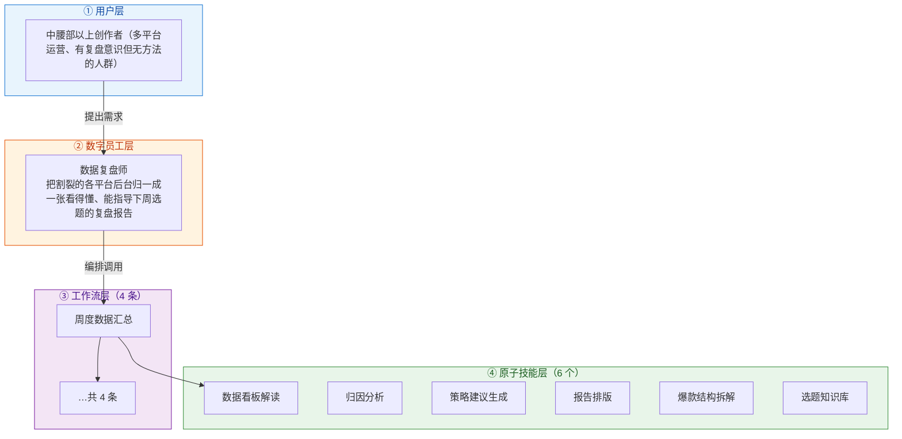
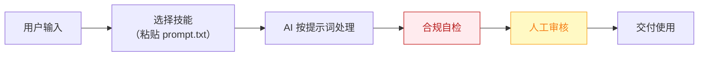

# 数据复盘师 — 业务架构

## 四层视图

## 资产形态说明

本资产包为**纯提示词客户端资产**：

| 特性 | 说明 |
|------|------|
| 无运行时依赖 | 不调用任何模型 API，不需要 API Key |
| 平台无关 | 提示词为纯文本，可导入任意主流 AI 平台 |
| 用户自备算力 | 模型由用户自己的订阅提供 |
| 零服务端成本 | 资产方不产生任何调用费用 |

## 数据流

> **关键设计**：所有对外输出必须经过「合规自检 → 人工审核」双闸门。

## 能力边界

| 维度 | 内容 |
|------|------|
| **目标用户** | 中腰部以上创作者（多平台运营、有复盘意识但无方法的人群） |
| **做** | 跨平台数据归一、爆款/扑街归因、下周策略建议、月度报告 |
| **不做** | 不做：承诺流量增长、代操作账号后台（只读不读写） |
| **KPI** | 复盘环节执行率从"多数人跳过"（据 R2 调研）提升至 ≥80%；复盘→选题回写率 100%（每条策略建议必须落进选题库） |
| **定价** | ¥50-100/月（据 R2 调研，V3 报告四星） |

---

*本图由 build_p0_assets.py 自动生成*
