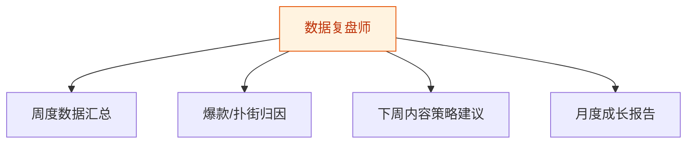
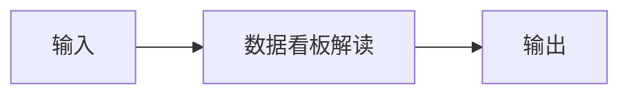
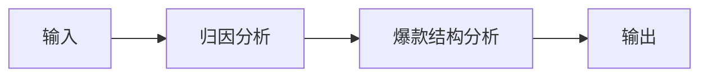
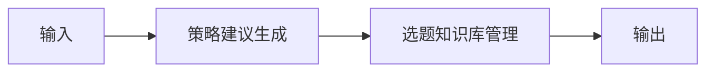
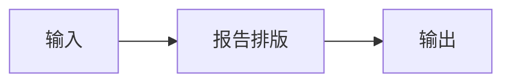

# 数据复盘师 — 工作流流程图

本员工共 **4 条工作流**，下辖 **6 个原子技能**。

## 总览

## 分条详情

### 周度数据汇总

| 项目 | 内容 |
|------|------|
| 触发 | 定时（每周日） |
| 复杂度 | `M` |
| 阶段 | `P1` |
| ROI | 手动翻后台 0.5-1h/天→10min/周，月省约 12h≈¥360 |

### 爆款/扑街归因

| 项目 | 内容 |
|------|------|
| 触发 | 事件（WF1 后自动） |
| 复杂度 | `M` |
| 阶段 | `P1` |
| ROI | 归因质量直接决定选题命中率，复利价值 |

### 下周内容策略建议

| 项目 | 内容 |
|------|------|
| 触发 | 事件（WF2 后自动） |
| 复杂度 | `S` |
| 阶段 | `P1` |
| ROI | 闭环收口："复盘→选题"断点修复，这是所有竞品都没有的能力（据 R2 调研） |

### 月度成长报告

| 项目 | 内容 |
|------|------|
| 触发 | 定时（每月 1 日） |
| 复杂度 | `S` |
| 阶段 | `P2` |
| ROI | 对外分享的成长报告本身是获客传播素材 |

## 汇总表

| # | 工作流 | 阶段 | 复杂度 | 触发 | 涉及技能数 |
|---|--------|------|--------|------|-----------|
| 1 | 周度数据汇总 | `P1` | `M` | 定时（每周日） | 1 |
| 2 | 爆款/扑街归因 | `P1` | `M` | 事件（WF1 后自动） | 2 |
| 3 | 下周内容策略建议 | `P1` | `S` | 事件（WF2 后自动） | 2 |
| 4 | 月度成长报告 | `P2` | `S` | 定时（每月 1 日） | 1 |

---

*本图由 build_p0_assets.py 自动生成*
