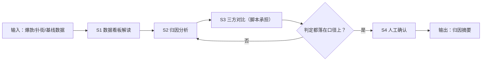

# 爆款/扑街归因

## 元信息

| 字段 | 值 |
|------|-----|
| ID | `de_media_06_wf02` |
| 类型 | **`composite`（复合技能）** |
| 所属员工 | 数据复盘师 |
| 阶段 | `P1` |
| 复杂度 | `M` |
| 触发方式 | 事件（WF1 后自动） |
| ROI | 归因质量直接决定选题命中率，复利价值 |
| 资产形态 | 提示词编排 + Python 对比脚本（`scripts/run_flow.py`，仅标准库） |

> 复合技能 = 工作流。它把多个**原子技能**按业务顺序编排在一起，完成一个完整场景。

## 能力描述

爆款/扑街视频与账号基线的三方量化归因。S1 数据归一；S2 按占比分级写驱动因素（≥ 50% 主引擎 / ≥ 20% 重要因素 / 其余存疑）并用因果三检验降级；S3 脚本承担确定性对比：播放 ≥ 基线 2 倍记真爆款、三连率/完播率差 ≥ 3pp 记显著、扑街低于基线 ≥ 30% 记显著扑街、内容形式与开头 5 秒钩子逐项对照；S4 人工确认后才进选题。

## 编排的原子技能

| # | 原子技能 | 能力 |
|---|---------|------|
| 1 | [归因分析](../../skills/attribution-analysis/) | 内容特征与数据表现的关联归因 |
| 2 | [爆款结构拆解](../../skills/viral-structure-decode/) | 爆款结构拆解（五段切分 + 功能定位） |

## 步骤链路（DAG）



## 步骤明细

| # | 步骤 | 技能资产 | 输入 | 输出 | 失败处理 |
|---|------|---------|------|------|---------|
| 1 | 数据归一 | [`../../skills/dashboard-interpret/`](../../skills/dashboard-interpret/) | account + hit + flop + baseline | 统一指标 | 缺口径退回补充 |
| 2 | 归因分析 | [`../../skills/attribution-analysis/`](../../skills/attribution-analysis/) | 归一数据 + context | 驱动因素 + 置信度 | 证据不足降级为存疑 |
| 3 | 三方对比 | 本流脚本 `scripts/run_flow.py` | hit + flop + baseline | 对比表 + 判定 | hit/baseline 缺失中止 |
| 4 | 人工确认 | （人工） | 归因摘要.md | 确认版结论 | 存疑因素必须逐条过 |

## 步骤说明

内容特征×数据表现关联→三方量化对比→归因结论+证据链

## 输入规格

| 字段 | 类型 | 必填 | 说明 |
|------|------|------|------|
| `account` | string | ✅ | 账号名称与平台 |
| `hit` | object | ✅ | 爆款：标题/日期/播放/三连率/完播率/涨粉/形式/开头 5 秒 |
| `flop` | object | ⬜ | 扑街：字段同 hit；缺省只做爆款 vs 基线 |
| `baseline` | object | ✅ | 基线：篇均播放/三连率/完播率 |
| `context` | string | ⬜ | 投放、发布时间、同期事件（排除解释用） |

## 输出规格

| 字段 | 类型 | 说明 |
|------|------|------|
| `summary` | string | 执行摘要（爆款 ×N 倍 / 扑街 -N% / 首要归因） |
| `steps` | string | 分步结果（对比表 + 驱动因素证据） |
| `deliverable` | string | 归因摘要（含可复用结构要点与 AI 标识） |

**脚本产物**（`--demo` 或 `--input` 实跑落盘）：

| 文件 | 内容 |
|---|---|
| `out/爆款扑街对比表.csv` | 指标 × 爆款 × 扑街 × 基线 × 判定 |
| `out/hit_flop_flow.json` | 机器可读结果（对比 + 阈值口径） |
| `out/归因摘要.md` | 执行摘要 + 对比表（Markdown） |

## 使用步骤

### 方式一：纯提示词编排（跨平台）

1. 把 `prompt.txt` 全文粘贴为系统提示词
2. 提供爆款/扑街/基线三组数据与背景
3. 按 S1→S2→S3→S4 得到确认版归因；倍数与差值用脚本实测

### 方式二：带脚本（端到端产物）

```bash
python <WF_DIR>/scripts/run_flow.py --input input.json --outdir out
python <WF_DIR>/scripts/run_flow.py --demo
```

### 平台编排

| 平台 | 编排方式 |
|------|---------|
| **Coze / 扣子** | S1/S2 节点填对应技能 prompt.txt，S3 用代码节点跑 run_flow.py |
| **Dify** | Workflow → LLM 节点链 + 代码节点 |
| **WorkBuddy** | 新建 Skill，按 prompt.txt 步骤串联 |

## 边界（不做的事）

- ❌ 不把相关写成因果——因果三检验不全过一律记「相关」
- ❌ 不夸大：< 2 倍的播放只记「相对高点」，不称爆款
- ❌ 不用模型口算替代脚本对比——以 run_flow.py 输出为准
- ❌ 不对单次样本下发布时间结论（需多次对照）
- ❌ 不跳过人工确认把归因直接写进选题依据
- ❌ 不编造基线：无基线数据时中止并索要，不估算

## 调用示例

**输入**（`examples/input.json`）：B站账号「老陈聊硬件」，爆款 10.3《千元的显卡居然能打游戏？》播放 9.8万 / 三连率 7.2%，扑街 10.6《RTX 5080 首发快评》播放 0.9万，基线篇均 2.3万 / 三连率 4.1%。

**输出**（脚本实跑）：爆款 ×4.3 记真爆款；三连率 +3.1pp、完播率 +14pp 记显著差异；扑街低于基线 60.9% 记显著扑街；结构对照锁定「测试反差型 vs 参数口播型、开头 5 秒有无钩子」为首要候选归因。产物落 `out/` 三件。

## 所属工作流

上游：[周度数据汇总](../weekly-data-aggregate-flow/)（周表 → 选题材）；下游：[下周内容策略建议](../nextweek-content-strategy-flow/)（归因 → 策略与选题）。

## 错误处理

| 情况 | 处理方式 |
|------|---------|
| 输入缺失 | 提示缺少的字段，终止流程 |
| 中间步骤输出不合规 | 合规技能拦截，返回修改建议，不继续下游 |
| 提示词被平台截断 | 拆分任务，分两次处理 |
| 基线/爆款数据缺失 | 中止索要，不估算基线 |

## 验收标准

- [ ] 每一步的技能资产齐全（SKILL.md / prompt.txt / schema.json）
- [ ] 步骤间输入输出字段可衔接
- [ ] 末步输出带 AI 生成标识
- [ ] 全流程有人工确认环节

## 合规声明

- 本工作流输出为 **AI 辅助归因结果**，交付前必须经人工复核
- 归因结论不构成对平台推荐机制的断言，仅供内容策略参考
- 经营数据含账号商业信息，不对外披露明细
- 请按所在平台要求完成 AI 生成内容标识

---

*本复合技能遵循 [bangwozuo 数字员工资产规范](https://github.com/bangwozuo/digital-employee-spec) v3.0*
