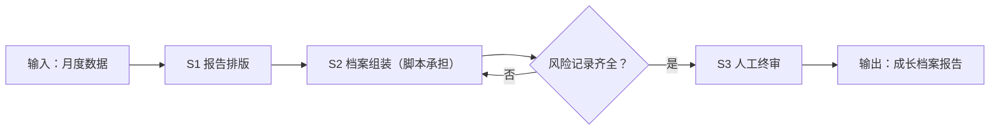

# 月度成长报告

## 元信息

| 字段 | 值 |
|------|-----|
| ID | `de_media_06_wf04` |
| 类型 | **`composite`（复合技能）** |
| 所属员工 | 数据复盘师 |
| 阶段 | `P2` |
| 复杂度 | `S` |
| 触发方式 | 定时（每月 1 日） |
| ROI | 对外分享的成长报告本身是获客传播素材 |
| 资产形态 | 提示词编排 + Python 档案脚本（`scripts/run_flow.py`，仅标准库） |

> 复合技能 = 工作流。它把多个**原子技能**按业务顺序编排在一起，完成一个完整场景。

## 能力描述

月度数据 → 可对外分享的成长档案报告。S1 报告排版做环比与显著标注（|Δ| ≥ 10%）；S2 脚本承担确定性组装：系列按篇均阅读降序、档位差 ≥ 2 倍写「档位拉开」、单篇 ≥ 篇均 2 倍记「月度爆款」、投诉/版权等风险记录如实保留、收入类数字对外聚合为档位（如 500~1000元）；S3 人工终审后才可对外发布。

## 编排的原子技能

| # | 原子技能 | 能力 |
|---|---------|------|
| 1 | [报告排版](../../skills/report-layout/) | 数据报告结构化排版输出 |

## 步骤链路（DAG）



## 步骤明细

| # | 步骤 | 技能资产 | 输入 | 输出 | 失败处理 |
|---|------|---------|------|------|---------|
| 1 | 报告排版 | [`../../skills/report-layout/`](../../skills/report-layout/) | period + metrics | 环比表 + 排名 | 缺上期环比记「—」 |
| 2 | 档案组装 | 本流脚本 `scripts/run_flow.py` | metrics + series + hit + risk_log | 关键指标表 + 档案骨架 | metrics 为空中止 |
| 3 | 人工终审 | （人工） | 成长档案报告.md | 确认版 | 风险记录被删改即退回 |

## 步骤说明

月度数据→成长档案报告（可对外分享）

## 输入规格

| 字段 | 类型 | 必填 | 说明 |
|------|------|------|------|
| `title` | string | ✅ | 报告标题（如「公众号『市井食光』2026年10月成长档案」） |
| `period` | string | ✅ | 报告月份 |
| `metrics` | array | ✅ | 指标数组（name/cur/prev/unit） |
| `series` | array | ⬜ | 内容系列（name/篇数/篇均阅读） |
| `hit` | object | ⬜ | 月度爆款（标题/日期/阅读/涨粉/事件） |
| `risk_log` | array | ⬜ | 风险记录（投诉/删除等，如实提供） |
| `publish_note` | string | ⬜ | 对外聚合口径（如收入聚合为档位） |

## 输出规格

| 字段 | 类型 | 说明 |
|------|------|------|
| `summary` | string | 执行摘要（最大变化 + 爆款 + 风险提示） |
| `steps` | string | 分步结果（环比表 + 系列拆解） |
| `deliverable` | string | 成长档案报告（带 AI 标识与复核声明） |

**脚本产物**（`--demo` 或 `--input` 实跑落盘）：

| 文件 | 内容 |
|---|---|
| `out/月度关键指标.csv` | 指标 × 本月 × 上月 × 变化 × 是否显著 |
| `out/monthly_flow.json` | 机器可读结果（环比/系列/爆款/风险/口径） |
| `out/成长档案报告.md` | 可对外分享的报告骨架（Markdown 表格） |

## 使用步骤

### 方式一：纯提示词编排（跨平台）

1. 把 `prompt.txt` 全文粘贴为系统提示词
2. 提供月度指标、内容系列、爆款与风险记录
3. 按 S1→S2→S3 得到确认版报告；环比与档位用脚本实测

### 方式二：带脚本（端到端产物）

```bash
python <WF_DIR>/scripts/run_flow.py --input input.json --outdir out
python <WF_DIR>/scripts/run_flow.py --demo
```

### 平台编排

| 平台 | 编排方式 |
|------|---------|
| **Coze / 扣子** | S1 节点填 report-layout 的 prompt.txt，S2 用代码节点跑 run_flow.py |
| **Dify** | Workflow → LLM 节点 + 代码节点 |
| **WorkBuddy** | 新建 Skill，按 prompt.txt 步骤串联 |

## 边界（不做的事）

- ❌ 不删除或美化投诉、版权等负面记录
- ❌ 不在对外版披露未公开的商业敏感明细（收入按档位聚合）
- ❌ 不用模型口算替代脚本计算——以 run_flow.py 输出为准
- ❌ 缺上期数据时环比记「—」，不估算、不补零
- ❌ 未经人工终审的报告不对外发布
- ❌ 引用他人内容须已获授权，否则进风险记录

## 调用示例

**输入**（`examples/input.json`）：公众号「市井食光」2026年10月，粉丝净增 1,890（9月 1,120）、篇均阅读 4,350（3,610）、流量主收入 612元（485元），系列 3 档，10.14 爆款阅读 1.6万，10.20 图片版权投诉 1 次。

**输出**（脚本实跑）：显著指标 3 项（粉丝 +68.8%、篇均阅读 +20.5%、收入 +26.2%）；系列档位差 2.9 倍；10.14 记月度爆款（≥ 篇均 2 倍）；版权投诉如实进风险记录。产物落 `out/` 三件。

## 所属工作流

上游：[周度数据汇总](../weekly-data-aggregate-flow/)（周表 → 月度数据源）；本流为月度收口资产，报告可对外分享作为获客传播素材。

## 错误处理

| 情况 | 处理方式 |
|------|---------|
| 输入缺失 | 提示缺少的字段，终止流程 |
| 中间步骤输出不合规 | 合规技能拦截，返回修改建议，不继续下游 |
| 提示词被平台截断 | 拆分任务，分两次处理 |
| 风险记录缺失 | 提示用户补充；对外版必须含风险记录段 |
| 上期数据缺失 | 环比记「—」，不估算 |

## 验收标准

- [ ] 每一步的技能资产齐全（SKILL.md / prompt.txt / schema.json）
- [ ] 步骤间输入输出字段可衔接
- [ ] 末步输出带 AI 生成标识
- [ ] 全流程有人工确认环节

## 合规声明

- 本工作流输出为 **AI 辅助报告**，对外分享前必须经人工终审
- 引用他人内容（转载、图片）须已获授权，版权风险如实记录
- 报告含账号商业信息，敏感数字按档位聚合后再对外
- 请按所在平台要求完成 AI 生成内容标识

---

*本复合技能遵循 [bangwozuo 数字员工资产规范](https://github.com/bangwozuo/digital-employee-spec) v3.0*
