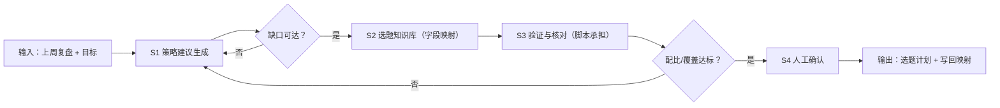

# 下周内容策略建议

## 元信息

| 字段 | 值 |
|------|-----|
| ID | `de_media_06_wf03` |
| 类型 | **`composite`（复合技能）** |
| 所属员工 | 数据复盘师 |
| 阶段 | `P1` |
| 复杂度 | `S` |
| 触发方式 | 事件（WF2 后自动） |
| ROI | 闭环收口："复盘→选题"断点修复，这是所有竞品都没有的能力（据 R2 调研） |
| 资产形态 | 提示词编排 + Python 拆解脚本（`scripts/run_flow.py`，仅标准库） |

> 复合技能 = 工作流。它把多个**原子技能**按业务顺序编排在一起，完成一个完整场景。

## 能力描述

归因结论 → 经过验证的下周选题计划。S1 策略建议生成做目标缺口拆解（缺口 = 周均目标 − 当前周均，按条数 × 单条验证线校验可达性）；S2 选题知识库给写回字段映射（本流不直接写库）；S3 脚本承担确定性核对：单条涨粉 ≥ 验证线 1,500 记复现成功、已验证形式占比 ≥ 60%、新形式 ≤ 1 条/周、外推覆盖缺口 ≥ 80% 否则给降档方案；S4 人工确认后才写回选题库。

## 编排的原子技能

| # | 原子技能 | 能力 |
|---|---------|------|
| 1 | [策略建议生成](../../skills/strategy-advice-generate/) | 归因结论转可执行策略与选题方向 |
| 2 | [选题知识库](../../skills/topic-knowledge-base/) | 选题库读写字段映射与操作 SOP |

## 步骤链路（DAG）



## 步骤明细

| # | 步骤 | 技能资产 | 输入 | 输出 | 失败处理 |
|---|------|---------|------|------|---------|
| 1 | 策略拆解 | [`../../skills/strategy-advice-generate/`](../../skills/strategy-advice-generate/) | goal + verified + resources | 分步动作 + 验证线 | 缺目标中止 |
| 2 | 写回映射 | [`../../skills/topic-knowledge-base/`](../../skills/topic-knowledge-base/) | 计划表 + 目标系统 | 字段映射 + SOP | 字段对不上列待确认清单 |
| 3 | 验证核对 | 本流脚本 `scripts/run_flow.py` | goal + verified + plan | 策略验证表 + 选题计划表 | goal.weekly_target 缺失中止 |
| 4 | 人工确认 | （人工） | 策略摘要.md | 确认版计划 → 写回 | 未过线动作不得进计划 |

## 步骤说明

归因→策略→验证→直接写回智能体 1 的选题库

## 输入规格

| 字段 | 类型 | 必填 | 说明 |
|------|------|------|------|
| `account` | string | ✅ | 账号名称与平台 |
| `period` | string | ✅ | 上周复盘周期（如 10.5-10.11） |
| `goal` | object | ✅ | `weekly_target` / `weekly_actual`（如 9,000 / 5,005） |
| `verified` | array | ✅ | 已验证动作（验证线/条数/单条均值/合计） |
| `others` | array | ⬜ | 常规动作表现 |
| `resources` | string | ⬜ | 人力小时/周、外包预算元/周 |
| `plan` | array | ✅ | 选题计划（week/title/form/date/owner） |

## 输出规格

| 字段 | 类型 | 说明 |
|------|------|------|
| `summary` | string | 执行摘要（缺口/验证结论/配比） |
| `steps` | string | 分步结果（验证表 + 缺口拆解 + 计划） |
| `deliverable` | string | 确认版选题计划 + 写回字段映射 |

**脚本产物**（`--demo` 或 `--input` 实跑落盘）：

| 文件 | 内容 |
|---|---|
| `out/策略验证表.csv` | 上周动作 × 验证线 × 实际 × 判定 |
| `out/选题计划表.csv` | 2 周选题 × 形式 × 发布日 × 负责人 × 定位 |
| `out/nextweek_flow.json` | 机器可读结果（验证 + 缺口 + 计划 + 阈值） |
| `out/策略摘要.md` | 执行摘要（Markdown 表格） |

## 使用步骤

### 方式一：纯提示词编排（跨平台）

1. 把 `prompt.txt` 全文粘贴为系统提示词
2. 提供上周复盘、目标与资源约束
3. 按 S1→S2→S3→S4 得到确认版计划；缺口与占比用脚本实测

### 方式二：带脚本（端到端产物）

```bash
python <WF_DIR>/scripts/run_flow.py --input input.json --outdir out
python <WF_DIR>/scripts/run_flow.py --demo
```

### 平台编排

| 平台 | 编排方式 |
|------|---------|
| **Coze / 扣子** | S1/S2 节点填对应技能 prompt.txt，S3 用代码节点跑 run_flow.py |
| **Dify** | Workflow → LLM 节点链 + 代码节点 |
| **WorkBuddy** | 新建 Skill，按 prompt.txt 步骤串联 |

## 边界（不做的事）

- ❌ 不直接写库——写回必须经人工确认后由用户用连接器执行
- ❌ 不把未过验证线的动作排进正式计划
- ❌ 不用模型口算替代脚本拆解——以 run_flow.py 输出为准
- ❌ 新形式试水 ≤ 1 条/周，不批量押注未验证形式
- ❌ 目标不可达时给降档方案，不静默压缩目标或假装可达
- ❌ 不涉及资金操作，预算只做草稿

## 调用示例

**输入**（`examples/input.json`）：抖音账号「职场老王说」10.5-10.11 复盘，周均目标 9,000 / 实际 5,005，新形式单条均值 1,540（验证线 1,500，复现成功），下周计划 6 条（话术 5 + 试水 1）。

**输出**（脚本实跑）：缺口 3,995/周；话术 3 条/周外推约 4,620，覆盖缺口 116%；已验证形式占比 83.3% 达标（≥ 60%）；选题计划 6 条落表，写回目标锁定飞书多维表格「内容选题库」选题池表。产物落 `out/` 四件。

## 所属工作流

上游：[爆款/扑街归因](../hit-flop-attribution-flow/)（归因 → 策略依据）；本流输出写回选题库后供日常选题消费，形成「复盘→策略→选题」闭环。

## 错误处理

| 情况 | 处理方式 |
|------|---------|
| 输入缺失 | 提示缺少的字段，终止流程 |
| 中间步骤输出不合规 | 合规技能拦截，返回修改建议，不继续下游 |
| 提示词被平台截断 | 拆分任务，分两次处理 |
| 验证线未过 | 触发回退动作，退回上一验证形式 |
| 外推覆盖 < 80% | 显式提示目标偏激进，给降档方案 |

## 验收标准

- [ ] 每一步的技能资产齐全（SKILL.md / prompt.txt / schema.json）
- [ ] 步骤间输入输出字段可衔接
- [ ] 末步输出带 AI 生成标识
- [ ] 全流程有人工确认环节

## 合规声明

- 本工作流输出为 **AI 辅助策略结果**，交付前必须经人工复核
- 写回第三方系统仅限用户授权的目标表，凭据由用户自行配置，最小授权
- 选题计划含账号商业信息，不对外披露明细
- 请按所在平台要求完成 AI 生成内容标识

---

*本复合技能遵循 [bangwozuo 数字员工资产规范](https://github.com/bangwozuo/digital-employee-spec) v3.0*
