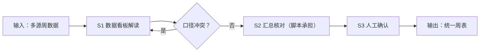

# 周度数据汇总

## 元信息

| 字段 | 值 |
|------|-----|
| ID | `de_media_06_wf01` |
| 类型 | **`composite`（复合技能）** |
| 所属员工 | 数据复盘师 |
| 阶段 | `P1` |
| 复杂度 | `M` |
| 触发方式 | 定时（每周日） |
| ROI | 手动翻后台 0.5-1h/天→10min/周，月省约 12h |
| 资产形态 | 提示词编排 + Python 汇总脚本（`scripts/run_flow.py`，仅标准库） |

> 复合技能 = 工作流。它把多个**原子技能**按业务顺序编排在一起，完成一个完整场景。

## 能力描述

多来源周度数据 → 一张可复盘的统一周表。S1 数据看板解读做同义字段归一（播放量/观看次数/阅读量 → 播放量）与单位换算（万 → 原始值）；S2 脚本承担确定性核对与汇总：交叉核对容差 ≤ 5% 判口径吻合、5%~15% 判口径接近、> 15% 判口径冲突（禁止并表），官方合计 vs 第三方去重差异 < 15% 属正常重叠，环比仅在上下两期口径一致时计算、缺失记「—」不补零；S3 人工确认口径差异与 |Δ| ≥ 20% 的环比异动。

## 编排的原子技能

| # | 原子技能 | 能力 |
|---|---------|------|
| 1 | [数据看板解读](../../skills/dashboard-interpret/) | 各平台后台数据的归一化解读 |

## 步骤链路（DAG）



## 步骤明细

| # | 步骤 | 技能资产 | 输入 | 输出 | 失败处理 |
|---|------|---------|------|------|---------|
| 1 | 数据看板解读 | [`../../skills/dashboard-interpret/`](../../skills/dashboard-interpret/) | period + account + sources | 归一指标 + 口径说明 | 字段对不上退回补口径 |
| 2 | 汇总核对 | 本流脚本 `scripts/run_flow.py` | 归一结果 + prev | 周度汇总表 + 交叉核对 | sources 为空中止；冲突只并列 |
| 3 | 人工确认 | （人工） | 周报摘要.md | 确认版周表 | 异动 ≥ 20% 逐条过 |

## 步骤说明

各平台后台数据导入→播放/完播/涨粉/转化归一→交叉核对→周报表

## 输入规格

| 字段 | 类型 | 必填 | 说明 |
|------|------|------|------|
| `period` | string | ✅ | 统计窗口（如 2026.9.29-10.5） |
| `account` | string | ✅ | 账号名称与平台 |
| `sources` | array | ✅ | 各来源原始指标（官方后台 / 第三方分行，含口径备注） |
| `target_metrics` | array | ⬜ | 要统一的指标清单（4~8 项） |
| `prev` | object | ⬜ | 上期数据，用于环比；缺省记「—」 |

## 输出规格

| 字段 | 类型 | 说明 |
|------|------|------|
| `summary` | string | 执行摘要（统一 N 项指标、M 组核对结论） |
| `steps` | string | 分步结果（归一 + 核对明细） |
| `deliverable` | string | 统一周表（含口径说明与 AI 生成标识） |

**脚本产物**（`--demo` 或 `--input` 实跑落盘）：

| 文件 | 内容 |
|---|---|
| `out/周度汇总表.csv` | 指标 × 本期 × 上期 × 环比 × 口径 |
| `out/weekly_flow.json` | 机器可读结果（统一表 + 交叉核对 + 结论） |
| `out/周报摘要.md` | 执行摘要 + 统一数据表（Markdown） |

## 使用步骤

### 方式一：纯提示词编排（跨平台）

1. 把 `prompt.txt` 全文粘贴为系统提示词
2. 提供统计窗口、账号、各来源数据与目标指标
3. 按 S1→S2→S3 得到确认版周表；核对数值用脚本实测，不靠口算

### 方式二：带脚本（端到端产物）

```bash
python <WF_DIR>/scripts/run_flow.py --input input.json --outdir out
python <WF_DIR>/scripts/run_flow.py --demo
```

### 平台编排

| 平台 | 编排方式 |
|------|---------|
| **Coze / 扣子** | S1 节点填 dashboard-interpret 的 prompt.txt，S2 用代码节点跑 run_flow.py |
| **Dify** | Workflow → LLM 节点 + 代码节点 |
| **WorkBuddy** | 新建 Skill，按 prompt.txt 步骤串联 |

## 边界（不做的事）

- ❌ 不做静默合并：口径冲突（差异 > 15%）的来源只并列，不平均、不择一舍弃
- ❌ 不补零、不估算：缺失指标记「—」，缺口列清单让用户补
- ❌ 不用模型口算替代脚本核对——差值与环比以 run_flow.py 输出为准
- ❌ 不跳过人工确认直接交付对外版本
- ❌ 不爬取需登录的私域数据，数据来源须可追溯

## 调用示例

**输入**（`examples/input.json`）：小红书账号「阿满的出租屋改造」2026.9.29-10.5，专业号后台 + 巨量算数两个来源，目标统一曝光/阅读/互动/涨粉 4 项，附上期数据。

**输出**（脚本实跑）：统一 4 项指标；交叉核对 2 组——曝光差 0.9%、互动差 0.6%，均 ≤ 5% 判口径吻合；环比互动 +21.9%、涨粉 +21.9%。产物落 `out/` 三件（CSV/JSON/MD）。

## 所属工作流

本资产为端到端工作流；上游可接 `store-data-collect` 类采集技能，下游接 [爆款/扑街归因](../hit-flop-attribution-flow/)（周表 → 归因）。

## 错误处理

| 情况 | 处理方式 |
|------|---------|
| 输入缺失 | 提示缺少的字段，终止流程 |
| 中间步骤输出不合规 | 合规技能拦截，返回修改建议，不继续下游 |
| 提示词被平台截断 | 拆分任务，分两次处理 |
| 口径冲突 | 只并列展示并标注，转人工裁决 |

## 验收标准

- [ ] 每一步的技能资产齐全（SKILL.md / prompt.txt / schema.json）
- [ ] 步骤间输入输出字段可衔接
- [ ] 末步输出带 AI 生成标识
- [ ] 全流程有人工确认环节

## 合规声明

- 本工作流输出为 **AI 辅助汇总结果**，交付前必须经人工复核
- 第三方监测数据仅作参考口径，对外引用须注明来源
- 经营数据含账号商业信息，不对外披露明细
- 请按所在平台要求完成 AI 生成内容标识

---

*本复合技能遵循 [bangwozuo 数字员工资产规范](https://github.com/bangwozuo/digital-employee-spec) v3.0*
